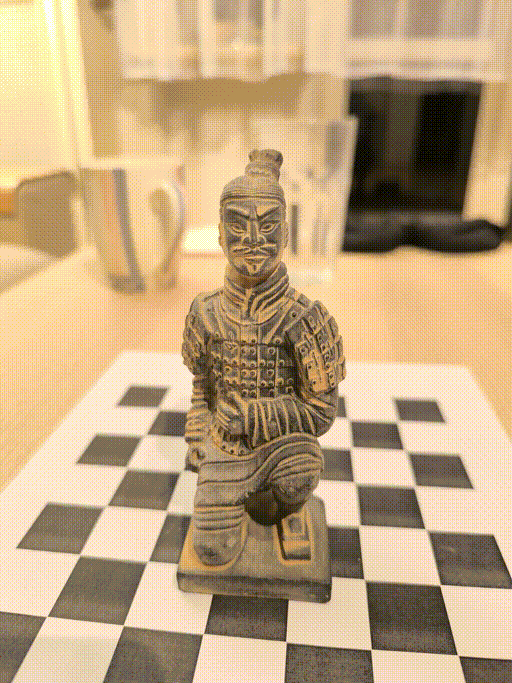
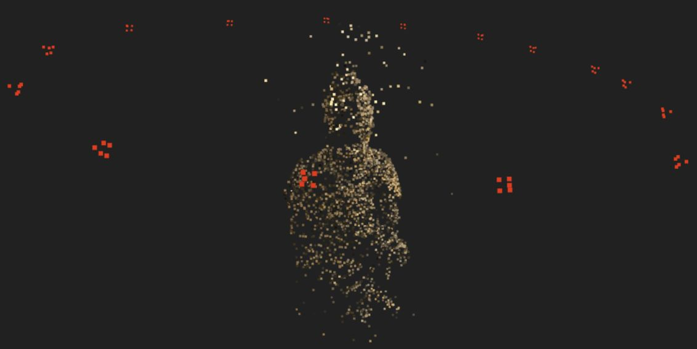
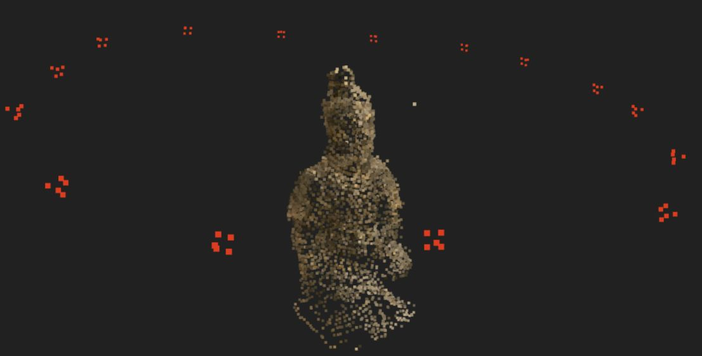
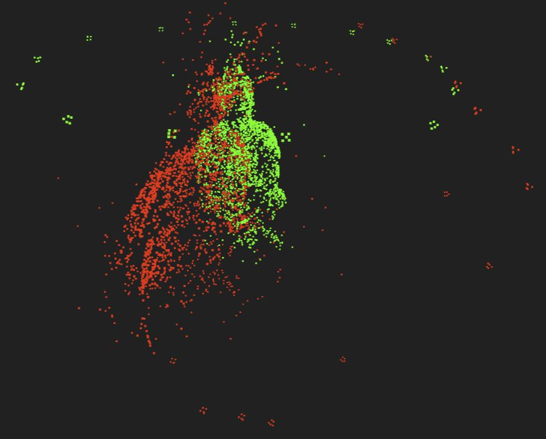
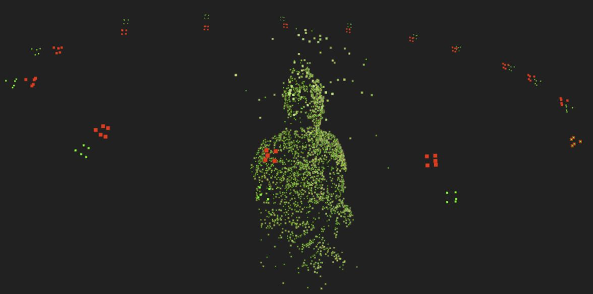
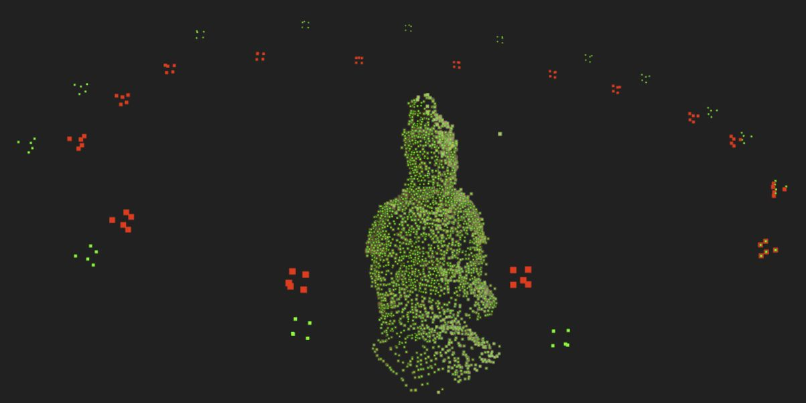
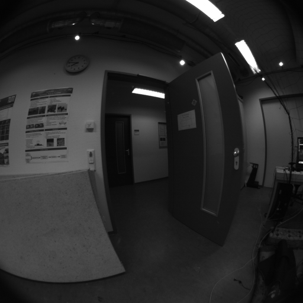
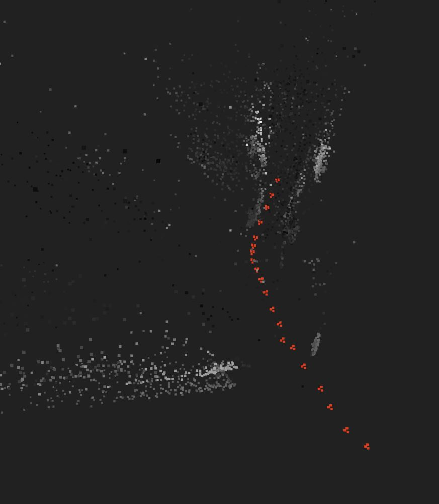
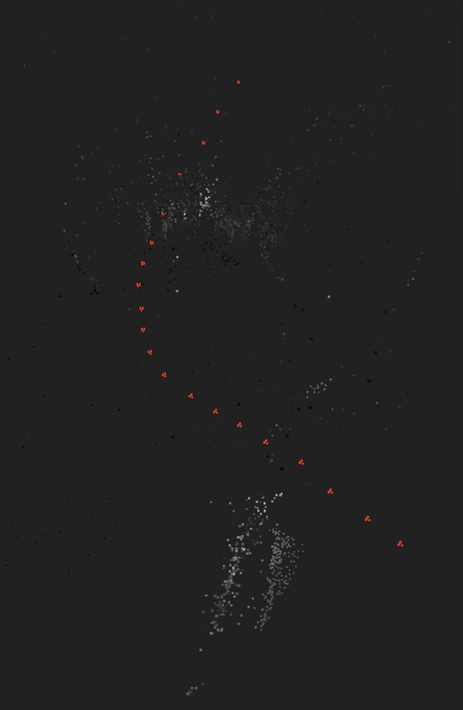

# Spatial Reconstruction Pipeline
## 🏆Goal:

Learn basic principles of 3D computer vision by building a Structure-from-Motion (SfM) pipeline for spatial reconstruction from a set of images.
The pipeline ingests a bunch of photos of one static object from different angles and outputs a (sparse) 3D point cloud model of the object and the estimated camera poses (for each photo).

<!-- Employ classical techniques to learn basic principles from 3D computer vision. Advance to deep learning techniques and Gaussian splatting representation for more accuracy and efficiency. -->

## ❌ Non-Goals:
- Do better than existing SfM pipelines (e.g. [GTSfM](https://github.com/borglab/gtsfm) or [COLMAP](https://colmap.github.io/install.html)) in terms of accuracy or efficiency.
- Implement a full photogrammetry pipeline (SfM + MVS) for dense reconstruction.
- Implement a full SLAM pipeline for spatial reconstruction from video sequences.


## 🧪 Experiments & Results
For feature (keypoint descriptor) extraction, I tested the classical SIFT features, which are still used in research and serve as a good baseline, and the learned neural DISK features (via `kornia` library).
For keypoint descriptor (feature) matching, I employed a classical Brute Force matcher (via the OpenCV's `BFMatcher`) as well as a learned neural LightGlue matcher (via `kornia` library).

### Dataset

I created my own `statue_orbit` dataset (at `data/raw/statue_orbit`) by taking 15 full-resolution (*3060 x 4080*) photos of a kneeling archer miniature statue from the Chinese terracotta army with my Redmi phone.
The statue measures about *12.5 cm* in height, and the base is roughly *4.5 x 4.5 cm*.
The photos have the head region slightly out of focus and photos of the statue's back exhibit, compared to the rest, a marked drop in illumination.
Both of these present a bit of a challenge for the SfM reconstruction pipeline. 
I wanted to code something that will work with real data, not just pristine lab data made with professional rigs.

<p align="center">
  
</p>

### Experimental Setups

  - **SIFT+BF**: SIFT features with Brute Force matcher
    - Number of features limited to maximum `num_features=2000`
    - The Brute-Force (BF) matcher computes symmetric matches (via `cross_check=True`)
    - See full parameter config in [`assets/statue_orbit_sift_bf_config.log`](assets/statue_orbit_sift_bf_config.log)
  - **DISK+LG**: [DISK features](https://arxiv.org/pdf/2006.13566) with [LightGlue matcher](https://arxiv.org/pdf/2306.13643)
    - Number of features limited to maximum `num_features=1000`
    - Only LightGlue matches with confidence above `lg_min_conf=0.1` are retained
    - See full parameter config in [`assets/statue_orbit_disk_lg_config.log`](assets/statue_orbit_disk_lg_config.log)


### Reconstruction from phone photos
Both of the following show a sparse point cloud reconstruction of the kneeling archer statue. 
The estimated statue points are colored by the corresponding pixel value in the images. 
The final estimated camera poses are shown as 5-point red pyramids representing the camera frustums.


*Figure: SIFT+BF: Note the pronounced presence of fliers around the head, which is likely due to the out-of-focus head region in the dataset images.*


*Figure: DISK+LG: Note the drastically reduced presence of fliers around the head compared to the SIFT+BF setup. The point cloud is also much denser despite the fact that max number of DISK features was limited to half of the max number of SIFT features.*


### Sensitivity to Camera Matrix
The reconstruction is extremely sensitive to small perturbation in the camera intrinsics. 
Below I compare reconstructions with original (calibrated) and perturbed camera intrinsics.


*Figure: SIFT+BF setup comparing the orignal reconstruction with camera intrinsics $K$ (green) and reconstruction with perturbed instrinsics $K'=0.999K$ (red). Slight deviation in intrinsics has decisive effect on the quality of the reconstructed point cloud as well as the estimated camera poses.*


### Effect of Bundle Adjustment
In the below figures I compare the resulting point cloud reconstruction pre- and post bundle adjustment for both feature+matcher setups.
The bundle adjustment is done only once at end of the SfM estimation to further refine the object points and the camera poses (the intrisics are fixed during optimization).


*Figure: SIFT+BF setup: After bundle adjustment the original camera poses out of SfM pipeline (red) are refined (green), while the points are largely unaffected.*

```
Ceres Solver Report: 
Iterations: 47, 
Initial cost: 2.435764e+03, 
Final cost: 7.472441e+02, 
Termination: CONVERGENCE
```
Full solver log in [`assets/statue_orbit_sift_bf_ba.log`](assets/statue_orbit_sift_bf_ba.log)


*Figure: DISK+LightGlue setup: After bundle adjustment the original camera poses out of SfM pipeline (red) are refined (green), while the points are largely unaffected.*

```
Ceres Solver Report: 
Iterations: 35, 
Initial cost: 6.514872e+03, 
Final cost: 1.699766e+03, 
Termination: CONVERGENCE
```
Full solver log in [`assets/statue_orbit_disk_lg_ba.log`](assets/statue_orbit_disk_lg_ba.log)


### Reconstruction from TUM-VI sequence
Out of curiosity, I wanted to see how my pipeline performs on a real benchmarking dataset where the camera doesn't orbit around an object. 
I chose [TUM-VI](https://cvg.cit.tum.de/data/datasets/visual-inertial-dataset) at first because it comes with IMU measurements, which I was hoping to use in related visual-inertial odometry learning project, but that has been put on ice due to time constraints.
In any case, I picked a sequence of 20 uniformly sampled frames between indices 540 and 640, which, at the frame rate of 20Hz, implies frame sampling frequency of 4Hz (250 ms between frames).
This subsequence contains enough motion so that a sufficient baseline is ensured.
Compared to the phone photos, TUM-VI provides additional challenge because the frames are distorted due to the fisheye cameras used by the recording rig. 
The further difficulty is the presence of many planar surfaces such as walls, which could cause problems for the camera pose estimation (via PnP or essential matrix decomposition).

<p align="center">
  
</p>

With the original distorted images, we get reconstruction that has more points. 
The camera pose estimates are plausible given the frame sequence.
Wall points that should be (ideally) estimated as coplanar look warped due to the fact that `cv.triangulatePoints` is effectively unable to account for the fisheye camera distortion, as it just assumes a simple pinhole camera projection matrices in its arguments.

<p align="center">
  
</p>

*Figure: Reconstruction on select frames of corridor4 TUM-VI sequence on the orignal distorted frames: the corridor is apparent and the estimated camera pose sequence looks plausible.*


The effect of image undistortion on the reconstruction is compared in the following figures. I used DISK features limited to `num_features=1000` with LightGlue matcher.
The undistortion procedure has a limiting effect on the field of view of the resulting images so that we end up with less points in the reconstructed point cloud.
The camera pose estimates are still plausible, but are noticeably different from the ones obtained with the original distorted frames.

<p align="center">
  
</p>

*Figure: Reconstruction on select frames of corridor4 TUM-VI sequence using the undistorted frames: the corridor is no longer apparent while the estimated camera pose sequence remains plausible.*


<!-- ## 🚧 Multi-view Stereo (MVS) Pipeline
= dense reconstruction from sparse 3D points and images -->

<!-- ## Reading List
S.D. Prince, Computer Vision: Models, Learning and Inference
SuperPoint
SuperGlue
TODO: list papers to read

## Notes
See [notes/CV_NOTES.md](notes/CV_NOTES.md) -->
